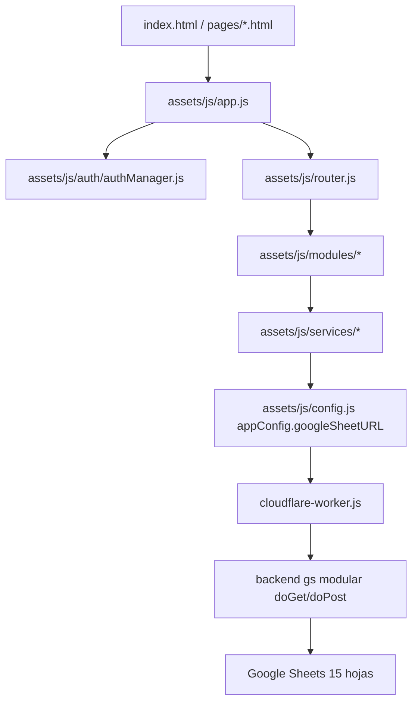

# Estructura y Relaciones - Control de Expedientes

Aplicación SPA para gestión de expedientes judiciales con frontend modular en ES modules, backend Google Apps Script y persistencia en Google Sheets, publicada detrás de Cloudflare Worker para resolver CORS.

Última actualización: 29 de abril de 2026

---

## 1) Arquitectura actual (real)

Nota importante:
- El flujo activo NO usa assets/js/utils/googleSheetsAPI.js.
- Ese archivo existe como referencia legacy/experimental, pero los módulos actuales consumen endpoints vía services + appConfig.googleSheetURL.

---

## 2) Estructura del repositorio

### 2.1 Raíz

| Ruta | Propósito |
|---|---|
| index.html | Entrada principal (data-page="login") |
| cloudflare-worker.js | Proxy CORS hacia Apps Script |
| package.json | Scripts de build CSS |
| tailwind.config.js | Configuración Tailwind |
| ESTRUCTURA_Y_RELACIONES.md | Documento maestro técnico |
| INTERFAZ_Y_BOTONES.md | Guía UI |
| backend/ | API Apps Script y documentación técnica |
| pages/ | Entradas HTML por módulo/ruta |
| assets/ | Frontend modular activo (css/js/icons) |
| js/, components/, data/ | Estructura legacy mantenida por compatibilidad |

### 2.2 pages/ (13 archivos)

| Archivo | data-page | Estado actual |
|---|---|---|
| login.html | login | Activo (entrada de autenticación) |
| dashboard.html | dashboard | Activo |
| registro-expedientes.html | registro | Activo |
| expedientes.html | expedientes | Activo |
| ubicaciones.html | ubicaciones | Activo |
| paquetes.html | paquetes | Activo |
| movimientos.html | movimientos | Activo |
| configuracion.html | configuracion | Activo |
| actualizacion.html | actualizacion | Activo |
| lectora.html | registro | Alias operativo de registro |
| lista-expedientes.html | expedientes | Alias legacy |
| nuevo-registro.html | registro | Alias legacy |
| panel.html | dashboard | Alias legacy |

Observación:
- No existe pages/busqueda.html en la estructura actual.

### 2.3 assets/js/ (núcleo activo)

#### Entrada y navegación

| Archivo | Rol |
|---|---|
| app.js | Bootstrap global, validaciones globales, autenticación inicial y arranque de router |
| router.js | Tabla ROUTES, render de layout, init de módulos y navegación interna |
| config.js | Config central de backend (googleSheetURL/registroExpedienteURL) |

#### auth/

| Archivo | Rol |
|---|---|
| authManager.js | Sesión validada contra backend, persistencia y vigilancia por inactividad |

#### services/ (11)

| Servicio | Rol principal |
|---|---|
| authService.js | Compatibilidad auth local/mock |
| expedienteService.js | Listado/consulta/actualización de expedientes + cache híbrida |
| paqueteService.js | Operaciones de paquetes y asignaciones (incluye lote) |
| estadoService.js | Catálogo de estados |
| materiaService.js | Catálogo de materias |
| juzgadoService.js | Catálogo de juzgados |
| ubicacionService.js | Operaciones de ubicación |
| ubicacionConfigService.js | Configuración de ubicaciones |
| parametroService.js | Parámetros de sistema |
| perfilService.js | Perfiles/roles |
| excelService.js | Exportación/soporte Excel |

#### modules/ (11 carpetas)

| Módulo | Estado y archivos clave |
|---|---|
| auth/ | login.js, loginPage.js |
| dashboard/ | dashboard.js, dashboardPage.js |
| expedientes/ | 9 archivos (registro/listado/backend integración) |
| paquetes/ | paquetes.js, paquetesPage.js, AsignarUbicacionPaquete.js, MoverPaqueteUbicacion.js |
| paquetesGeneral/ | paquetesGeneralView.js + components/ + utils/ |
| archivo-general/ | ArchivoGeneralPage.js, archivoGeneralService.js + modales de grupos/salida/retorno/asignación |
| movimientos/ | movimientosPage.js |
| ubicaciones/ | ubicaciones.js, ubicacionesPage.js |
| configuracion/ | configuracionPage.js + submódulos (estados, juzgados, materias, parámetros, perfil, ubicaciones-config) |
| actualizacion/ | actualizacionPage.js |
| busqueda/ | Carpeta existente, actualmente vacía (reservada) |

#### utils/

| Archivo | Rol |
|---|---|
| buttonIcons.js | Inyección de iconos por botón |
| expedienteParser.js | Parser de número de expediente |
| lectora.js | Parser de lectora (20-23 dígitos) |
| lectora-test.js | Pruebas del parser lectora |
| formatters.js | Formateadores |
| storage.js | Helpers de persistencia |
| validators.js | Validaciones |
| googleSheetsAPI.js | Cliente legacy de referencia (no flujo principal) |

### 2.4 backend/

| Archivo | Rol |
|---|---|
| *.gs (modular) | API principal separada por archivos (doGet/doPost + lógica de negocio) |
| ARQUITECTURA.md | Documentación de arquitectura backend |
| TESTING.js | Pruebas/ayudas para validación backend |
| README.md | Guía de despliegue y uso |

---

## 3) Rutas SPA reales (router.js)

Mapa exacto de ROUTES:

| Clave de ruta | Título | Init |
|---|---|---|
| dashboard | Dashboard Institucional | initDashboardPage |
| registro | Registro de Expedientes | initRegistroPage |
| expedientes | Listado de Expedientes | initListadoPage |
| paquetes | Paquetes para Archivo Modular | initPaquetesPage |
| paquetes-general | Paquetes para Archivo General | renderPaquetesGeneralView |
| paquetes-modular | Paquetes para Archivo Modular | initPaquetesPage |
| movimientos | Movimientos Activos | initMovimientosPage |
| movimientos-modular | Historial de Movimientos | initMovimientosPage |
| ubicaciones | Gestión de Ubicaciones | initUbicacionesPage |
| configuracion | Configuración del Sistema | initConfiguacionPage |
| actualizacion | Actualización de Datos | initActualizacionPage |
| archivo-general | Paquetes para Archivo General | renderPaquetesGeneralView |

Totales:
- 12 claves de ruta.
- 9 vistas funcionales únicas (por alias compartidos).

---

## 4) Relación entre capas

1. HTML define data-page (index o pages).
2. app.js inicializa AuthManager con URL del worker y resuelve sesión.
3. router.js toma data-page, busca ROUTES, renderiza layout e invoca route.init.
4. Cada módulo opera UI por components y reglas de negocio por services.
5. Services consumen appConfig.googleSheetURL (Cloudflare Worker).
6. Worker reenvía al backend Apps Script modular.
7. El backend modular ejecuta acción (GET/POST) sobre Google Sheets y responde JSON estandarizado.

---

## 5) API backend vigente (modular)

### 5.1 Acciones POST

- crear_usuario
- login_usuario
- registrar_expediente
- actualizar_expediente
- crear_paquete_archivo
- crear_paquete
- asignar_expediente_paquete
- asignar_expedientes_paquete_lote
- asignar_color_especialista
- desasignar_expediente_paquete
- crear_grupo_archivo_general
- asignar_expedientes_grupo_archivo
- desasignar_expediente_grupo_archivo
- asignar_grupo_a_paquete_archivo
- registrar_salida_archivo_general
- registrar_retorno_archivo_general

### 5.2 Acciones GET

- listar_usuarios
- obtener_usuario_por_dni
- listar_materias_activas
- listar_juzgados_activos
- listar_estados_activos
- listar_estados_sistema_activos
- listar_especialistas_activos
- listar_paquetes_archivo_con_expedientes
- listar_asistentes_activos
- listar_responsables_activos
- listar_paquetes_activos
- listar_expedientes
- obtener_expediente_por_codigo
- sugerir_paquete_para_expediente
- listar_paquetes_archivo
- listar_grupos_archivo_general
- listar_detalle_grupo_archivo
- listar_salidas_archivo_general
- obtener_grupo_con_detalle
- listar_expedientes_por_paquete

---

## 6) Modelo de datos en Google Sheets (15 hojas)

Hojas declaradas en backend Apps Script:

1. usuarios
2. materias
3. juzgados
4. estados
5. estados_sistema_expediente
6. paquetes
7. expedientes
8. seguimiento_expediente
9. paquetes_archivo
10. paquete_expediente
11. color_especialista
12. movimientos_expediente
13. grupo_archivo_general
14. grupo_archivo_general_detalle
15. salida_archivo_general

Relaciones clave:

1. expedientes.id_juzgado -> juzgados.id_juzgado
2. expedientes.codigo_materia / id_materia -> materias
3. expedientes.id_estado -> estados o estados_sistema_expediente
4. expediente.id_paquete_archivo (según flujo) -> paquetes_archivo.id_paquete_archivo
5. paquete_expediente.id_expediente -> expedientes.id_expediente
6. paquete_expediente.id_paquete_archivo -> paquetes_archivo.id_paquete_archivo
7. seguimiento_expediente.id_expediente -> expedientes.id_expediente
8. movimientos_expediente.id_expediente -> expedientes.id_expediente
9. color_especialista.id_usuario -> usuarios.id_usuario
10. grupo_archivo_general_detalle.id_grupo -> grupo_archivo_general.id_grupo
11. grupo_archivo_general_detalle.id_expediente -> expedientes.id_expediente
12. salida_archivo_general.id_grupo -> grupo_archivo_general.id_grupo

---

## 7) Flujos funcionales vigentes

1. Login:
    index/pages/login -> authManager.validarTrabajador(dni) -> obtener_usuario_por_dni.
2. Registro/edición de expediente:
    módulo expedientes -> registrar_expediente / actualizar_expediente -> seguimiento + estado asociado.
3. Paquetes archivo modular:
    crear_paquete_archivo -> asignar_expediente_paquete o asignar_expedientes_paquete_lote -> paquete_expediente.
4. Archivo general:
    crear_grupo_archivo_general -> asignar_expedientes_grupo_archivo -> registrar_salida_archivo_general / registrar_retorno_archivo_general -> asignar_grupo_a_paquete_archivo.
5. Catálogos de configuración:
    configuracion/* + services de catálogos -> listados activos (materias, juzgados, estados, responsables, etc.).

---

## 8) Legacy y compatibilidad

Se mantienen por compatibilidad o transición:

- js/app.js, js/lista.js, js/registro.js, js/excel-db.js
- components/*.html
- data/mock-data.js
- assets/js/utils/googleSheetsAPI.js (cliente antiguo, no principal)

Flujo principal recomendado:

- Solo assets/js/* + pages/* + backend/*.gs.

---

## 9) Guía para agregar nuevos módulos (sin romper lo actual)

Checklist mínimo:

1. Crear carpeta en assets/js/modules/nuevo-modulo/ con archivo nuevoModuloPage.js.
2. Exponer función initNuevoModuloPage({ mountNode }).
3. Registrar import e item en ROUTES de assets/js/router.js.
4. Crear página HTML en pages/ (o reutilizar data-page existente) con body data-page correcto.
5. Si requiere backend, agregar acciones nuevas en los archivos gs correspondientes (entrypoint y lógica).
6. Consumir backend desde un service en assets/js/services/ (no desde el módulo directamente, salvo casos muy puntuales ya existentes).
7. Mantener respuestas estándar: success, data, error/message.
8. Si el módulo usa catálogos, apoyarse en precarga/cache para no degradar navegación.
9. Validar flujo completo: abrir módulo, listar, crear/actualizar, refrescar vista y revisar trazabilidad.

Convenciones para mantener coherencia:

- Evitar duplicar lógica existente de servicios.
- Mantener inicialización sin imports dinámicos dentro de listeners.
- Mantener payloads en mayúsculas cuando aplique la normalización backend actual.

---

## 10) Qué faltaba en este documento y ya quedó agregado

Correcciones incorporadas:

1. Se confirma explícitamente que `assets/js/modules/nuevo-modulo/` existe pero está vacío (carpeta plantilla/reserva).
2. Se confirma explícitamente que `assets/js/modules/busqueda/` existe pero está vacío (reserva funcional).
3. Se agrega inventario y propósito del bloque `assets/js/core/*`, que no estaba detallado.
4. Se agrega guía archivo por archivo del frontend activo (en lenguaje directo), para que cualquier persona entienda para qué sirve cada pieza.

Notas de consistencia:

- La estructura frontend activa sí coincide con lo desplegado en el repositorio.
- El archivo `assets/js/utils/googleSheetsAPI.js` sigue existiendo solo como legacy, y no como flujo principal.

---

## 11) Qué hace cada archivo (explicado fácil)

Regla de lectura rápida:

- Si dice "Usa backend: Sí", ese archivo llama al worker/API.
- Si dice "Usa backend: No", ese archivo solo arma interfaz, valida o transforma datos en navegador.

### 11.1 Entrada y navegación

| Archivo | Qué hace (simple) | Usa backend |
|---|---|---|
| assets/js/app.js | Arranca toda la app. Aplica reglas globales (mayúsculas, solo números), decide si mostrar login o entrar al sistema. | Sí |
| assets/js/router.js | Es el "director de tránsito". Según la ruta, carga la pantalla correcta y monta layout + módulo. | Sí |
| assets/js/config.js | Guarda direcciones y configuración central para conectar con servicios. | No |

### 11.2 Autenticación

| Archivo | Qué hace (simple) | Usa backend |
|---|---|---|
| assets/js/auth/authManager.js | Maneja sesión del usuario: iniciar, validar, expirar por inactividad y cerrar sesión. | Sí |

### 11.3 Servicios (capa de llamadas a datos)

| Archivo | Qué hace (simple) | Usa backend |
|---|---|---|
| assets/js/services/authService.js | Servicio auxiliar de autenticación/compatibilidad. | Sí |
| assets/js/services/estadoService.js | Carga y cachea estados de expediente. | Sí |
| assets/js/services/excelService.js | Soporte para exportación/gestión de Excel desde frontend. | No |
| assets/js/services/expedienteService.js | Crea, lista y actualiza expedientes; además cachea para no recargar todo siempre. | Sí |
| assets/js/services/juzgadoService.js | Carga catálogo de juzgados. | Sí |
| assets/js/services/materiaService.js | Carga catálogo de materias. | Sí |
| assets/js/services/paqueteService.js | Crea/lista paquetes y hace asignaciones de expedientes (individual/lote). | Sí |
| assets/js/services/parametroService.js | Lee/actualiza parámetros del sistema. | Sí |
| assets/js/services/perfilService.js | Gestiona perfiles y roles. | Sí |
| assets/js/services/ubicacionConfigService.js | Gestiona configuración de ubicaciones. | Sí |
| assets/js/services/ubicacionService.js | Gestiona ubicaciones físicas (crear/listar/editar). | Sí |

### 11.4 Componentes UI reutilizables

| Archivo | Qué hace (simple) | Usa backend |
|---|---|---|
| assets/js/components/badge.js | Dibuja etiquetas visuales reutilizables. | No |
| assets/js/components/configDashboard.js | Define estructura/armado visual del dashboard. | No |
| assets/js/components/expedienteForm.js | Construye campos y comportamiento base del formulario de expediente. | No |
| assets/js/components/filters.js | Filtros reutilizables para búsquedas/listados. | No |
| assets/js/components/header.js | Cabecera superior (usuario, acciones rápidas). | No |
| assets/js/components/icons.js | Biblioteca de iconos SVG reutilizables. | No |
| assets/js/components/layout.js | Estructura principal de pantalla (sidebar + header + contenido). | No |
| assets/js/components/modal.js | Sistema de ventanas modal (confirmar, crear, editar, etc.). | No |
| assets/js/components/numeroExpedienteChip.js | Muestra número de expediente con formato visual tipo chip. | No |
| assets/js/components/sidebar.js | Menú lateral y navegación visual. | No |
| assets/js/components/statusBadge.js | Badge especializado para estados de expediente. | No |
| assets/js/components/summaryCard.js | Tarjetas de resumen/KPI. | No |
| assets/js/components/table.js | Tabla reutilizable para listados. | No |
| assets/js/components/toast.js | Mensajes flotantes (éxito, error, aviso). | No |

### 11.5 Core (núcleo técnico compartido)

| Archivo | Qué hace (simple) | Usa backend |
|---|---|---|
| assets/js/core/constants.js | Constantes globales para no repetir valores mágicos. | No |
| assets/js/core/helpers.js | Funciones auxiliares generales de uso común. | No |
| assets/js/core/storage.js | Utilidades base para guardar y leer datos locales. | No |
| assets/js/core/uiTokens.js | Tokens visuales base (colores/espaciados/estilo). | No |
| assets/js/core/validators.js | Validaciones base reutilizables. | No |

### 11.6 Utils (herramientas puntuales)

| Archivo | Qué hace (simple) | Usa backend |
|---|---|---|
| assets/js/utils/buttonIcons.js | Inserta iconos en botones automáticamente según marca/atributo. | No |
| assets/js/utils/expedienteParser.js | Desarma y valida formato de número de expediente. | No |
| assets/js/utils/formatters.js | Formatea valores (fechas, textos, etc.). | No |
| assets/js/utils/googleSheetsAPI.js | Cliente antiguo para Google Sheets. Se conserva por compatibilidad, no es el flujo principal. | Sí (legacy) |
| assets/js/utils/lectora-test.js | Pruebas del parser de lectora. | No |
| assets/js/utils/lectora.js | Interpreta códigos de lectora (código de barras/entrada numérica). | No |
| assets/js/utils/storage.js | Atajos de almacenamiento local usados por módulos. | No |
| assets/js/utils/validators.js | Validadores de campos usados por formularios. | No |

### 11.7 Data local

| Archivo | Qué hace (simple) | Usa backend |
|---|---|---|
| assets/js/data/mockData.js | Datos de prueba para desarrollo/escenarios de fallback. | No |

### 11.8 Módulos funcionales (pantallas)

#### actualizacion/

| Archivo | Qué hace (simple) | Usa backend |
|---|---|---|
| assets/js/modules/actualizacion/actualizacionPage.js | Pantalla de actualización de datos masivos o de mantenimiento. | Sí |

#### archivo-general/

| Archivo | Qué hace (simple) | Usa backend |
|---|---|---|
| assets/js/modules/archivo-general/ArchivoGeneralPage.js | Pantalla principal de archivo general (grupos, estado, acciones). | Sí |
| assets/js/modules/archivo-general/archivoGeneralService.js | Lógica de consumo para operaciones de archivo general. | Sí |
| assets/js/modules/archivo-general/ModalAsignarExpedientes.js | Modal para meter expedientes a un grupo. | Sí |
| assets/js/modules/archivo-general/ModalAsignarGrupoAPaquete.js | Modal para vincular grupo con paquete de archivo. | Sí |
| assets/js/modules/archivo-general/ModalCrearGrupo.js | Modal para crear grupo nuevo. | Sí |
| assets/js/modules/archivo-general/ModalRegistrarRetorno.js | Modal para registrar retorno de grupo/salida. | Sí |
| assets/js/modules/archivo-general/ModalRegistrarSalida.js | Modal para registrar salida de grupo. | Sí |
| assets/js/modules/archivo-general/ModalVerDetalleGrupo.js | Modal de detalle completo de un grupo. | Sí |
| assets/js/modules/archivo-general/README.md | Guía técnica del submódulo archivo general. | No |

#### auth/

| Archivo | Qué hace (simple) | Usa backend |
|---|---|---|
| assets/js/modules/auth/login.js | Lógica operativa del login (validación, envío, respuesta). | Sí |
| assets/js/modules/auth/loginPage.js | Renderiza pantalla de login y conecta eventos de ingreso. | Sí |

#### configuracion/

| Archivo | Qué hace (simple) | Usa backend |
|---|---|---|
| assets/js/modules/configuracion/actualizacion.js | Herramientas de actualización dentro del módulo configuración. | Sí |
| assets/js/modules/configuracion/configuracionPage.js | Pantalla contenedora de configuración del sistema. | Sí |
| assets/js/modules/configuracion/estados.js | Gestión de estados del sistema/expediente. | Sí |
| assets/js/modules/configuracion/juzgados.js | Gestión de catálogo de juzgados. | Sí |
| assets/js/modules/configuracion/materias-mejorado.js | Variante mejorada de gestión de materias. | Sí |
| assets/js/modules/configuracion/materias.js | Gestión base de materias. | Sí |
| assets/js/modules/configuracion/parametros.js | Gestión de parámetros globales. | Sí |
| assets/js/modules/configuracion/perfil.js | Gestión de perfiles y permisos. | Sí |
| assets/js/modules/configuracion/ubicaciones-config.js | Configuración de estructura de ubicaciones. | Sí |

#### dashboard/

| Archivo | Qué hace (simple) | Usa backend |
|---|---|---|
| assets/js/modules/dashboard/dashboard.js | Lógica auxiliar del dashboard (armado de datos/indicadores). | Sí |
| assets/js/modules/dashboard/dashboardPage.js | Pantalla principal dashboard (KPIs y resumen operativo). | Sí |

#### expedientes/

| Archivo | Qué hace (simple) | Usa backend |
|---|---|---|
| assets/js/modules/expedientes/expediente-form.js | Lógica del formulario de expediente (captura/validación). | Sí |
| assets/js/modules/expedientes/expediente-list.js | Render y utilidades del listado de expedientes. | Sí |
| assets/js/modules/expedientes/expediente-movimientos.js | Gestión/consulta de movimientos por expediente. | Sí |
| assets/js/modules/expedientes/expedientesMapeo.js | Mapeos y normalización de datos de expedientes. | No |
| assets/js/modules/expedientes/listadoPage.js | Página de listado legacy/compatibilidad. | Sí |
| assets/js/modules/expedientes/listadoPageBackend.js | Página de listado conectada al backend actual. | Sí |
| assets/js/modules/expedientes/registroExpedienteBackend.js | Registro de expediente usando backend. | Sí |
| assets/js/modules/expedientes/registroExpedienteBackendIntegracion.js | Capa de integración adicional para registro con backend. | Sí |
| assets/js/modules/expedientes/registroPage.js | Página principal de registro de expedientes en producción. | Sí |

#### movimientos/

| Archivo | Qué hace (simple) | Usa backend |
|---|---|---|
| assets/js/modules/movimientos/movimientosPage.js | Pantalla de movimientos activos/histórico operativo. | Sí |

#### paquetes/

| Archivo | Qué hace (simple) | Usa backend |
|---|---|---|
| assets/js/modules/paquetes/AsignarUbicacionPaquete.js | Flujo para asignar una ubicación física a un paquete. | Sí |
| assets/js/modules/paquetes/MoverPaqueteUbicacion.js | Flujo para mover paquetes entre ubicaciones. | Sí |
| assets/js/modules/paquetes/paquetes.js | Lógica base del módulo paquetes. | Sí |
| assets/js/modules/paquetes/paquetesPage.js | Pantalla principal de paquetes para archivo modular. | Sí |

#### paquetesGeneral/

| Archivo | Qué hace (simple) | Usa backend |
|---|---|---|
| assets/js/modules/paquetesGeneral/paquetesGeneralView.js | Vista de paquetes para archivo general. | Sí |

#### ubicaciones/

| Archivo | Qué hace (simple) | Usa backend |
|---|---|---|
| assets/js/modules/ubicaciones/ubicaciones.js | Lógica de negocio del módulo de ubicaciones. | Sí |
| assets/js/modules/ubicaciones/ubicacionesPage.js | Pantalla principal de gestión de ubicaciones. | Sí |

#### Carpetas reservadas

| Carpeta | Estado |
|---|---|
| assets/js/modules/busqueda/ | Existe, vacía, reservada para futura implementación. |
| assets/js/modules/nuevo-modulo/ | Existe, vacía, plantilla para módulos nuevos. |

